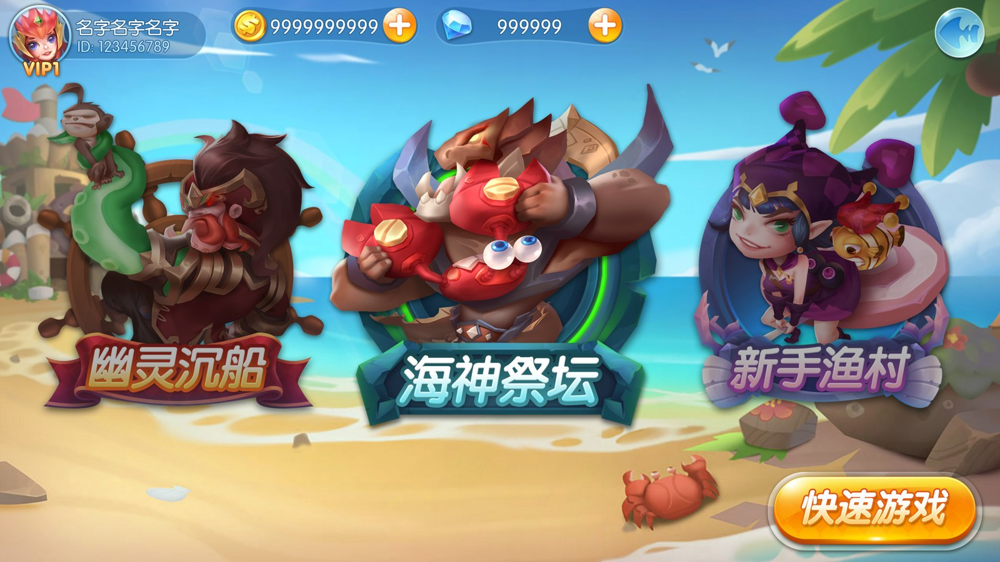
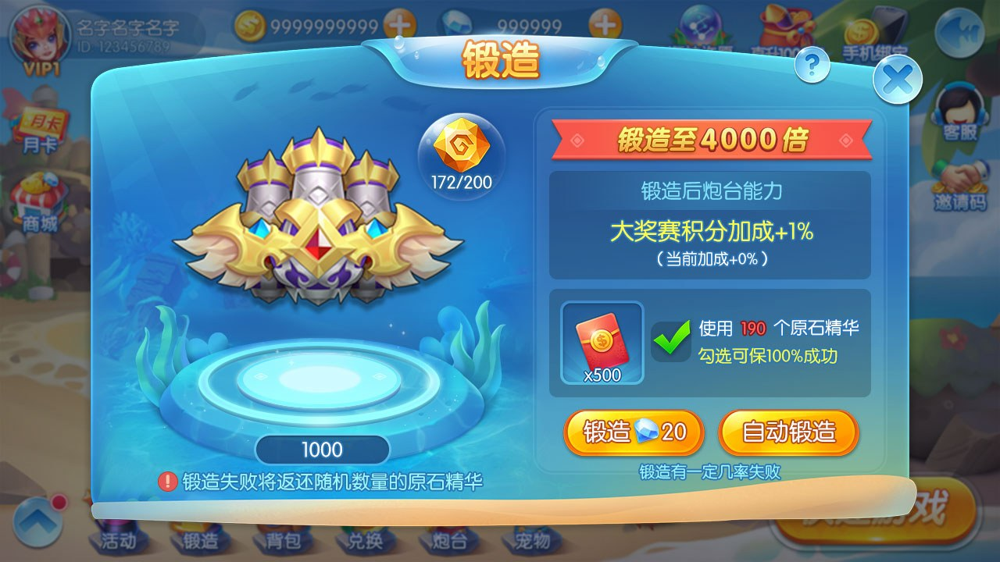
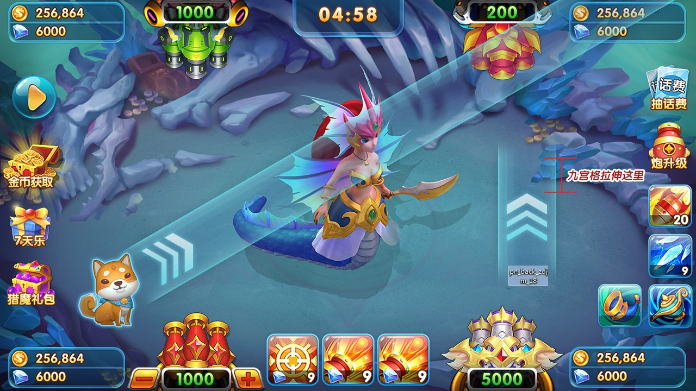

# Fishing Game Source Code | Cocos Client, C++ Server and Cannon Configuration

[简体中文](README.zh-CN.md) · [繁體中文](README.zh-TW.md) · [English](README.en.md) · [Product page](https://niubideren111.github.io/Fishing-Game-Source-Code/en/)

Arcade fishing game source materials covering room selection, cannon progression and boss battles, with public JavaScript configuration, client monitoring code, C++ logic and protocol documents.

**fishing game source code · Cocos fishing game · C++ fishing game server · arcade fish shooting source**

## What this repository presents

### Cannon configuration

Read cannon, level and skin configuration files to understand progression fields.

### Client and server flow

Combine the client monitor with protocol documents to study message flow.

### Battle logic

Use product screenshots and selected C++ files to review boss and projectile behavior.

## How to evaluate the material

1. **Confirm the product:** review the screenshots and captions to identify the product type and visible workflow.
2. **Inspect the evidence:** open the listed source files or documents instead of relying on feature claims alone.
3. **Check buildability:** verify that required dependencies, assets, configuration and startup scripts are present for the part you intend to run.
4. **Confirm licensing:** read the repository license and obtain written permission for any commercial assets or complete-project delivery.

## Product screenshots







## Public source and documents

| File | Description |
|---|---|
| [BYCannonConfig.js](BYCannonConfig.js) | Public JS file: BYCannonConfig.js. |
| [BYCannonLevelConfig.js](BYCannonLevelConfig.js) | Public JS file: BYCannonLevelConfig.js. |
| [GameMonitor.js](GameMonitor.js) | Public JS file: GameMonitor.js. |
| [bombctrl.cpp](bombctrl.cpp) | Public CPP file: bombctrl.cpp. |
| [客户端与服务器通信协议.md](%E5%AE%A2%E6%88%B7%E7%AB%AF%E4%B8%8E%E6%9C%8D%E5%8A%A1%E5%99%A8%E9%80%9A%E4%BF%A1%E5%8D%8F%E8%AE%AE.md) | Public MD file: 客户端与服务器通信协议.md. |
| [服务器间通信协议.md](%E6%9C%8D%E5%8A%A1%E5%99%A8%E9%97%B4%E9%80%9A%E4%BF%A1%E5%8D%8F%E8%AE%AE.md) | Public MD file: 服务器间通信协议.md. |

## Start reading

```bash
git clone https://github.com/niubideren111/Fishing-Game-Source-Code.git
cd Fishing-Game-Source-Code
```

## Questions

### Which languages are visible in the public files?

The public client configuration is primarily JavaScript and the selected server files are C++.

### Where should I start with the cannon system?

Begin with BYCannonConfig.js, then compare the level, list and skin configuration files.

## Documentation roadmap

Future updates should add a versioned dependency list, a verified setup or import procedure, a concise architecture or product-flow diagram, and release notes tied to real file changes. Large authorized assets belong in GitHub Releases with checksums; secrets, production endpoints and user data must never be committed.

## Related repositories

- [Fishing-Game-Art-Assets](https://github.com/niubideren111/Fishing-Game-Art-Assets)
- [Chess-and-Card-Game-Product-Design-Copy](https://github.com/niubideren111/Chess-and-Card-Game-Product-Design-Copy)

## Scope and license

The public repository contains selected code, configuration tables, protocol documents and screenshots. It is not presented as a complete one-command production deployment. Public files should be evaluated against their actual paths, dependencies and license. No search ranking, production readiness or performance result is guaranteed.

- Telegram: [@fox_lovemyself](https://t.me/fox_lovemyself)
- GitHub: [Fishing-Game-Source-Code](https://github.com/niubideren111/Fishing-Game-Source-Code)
