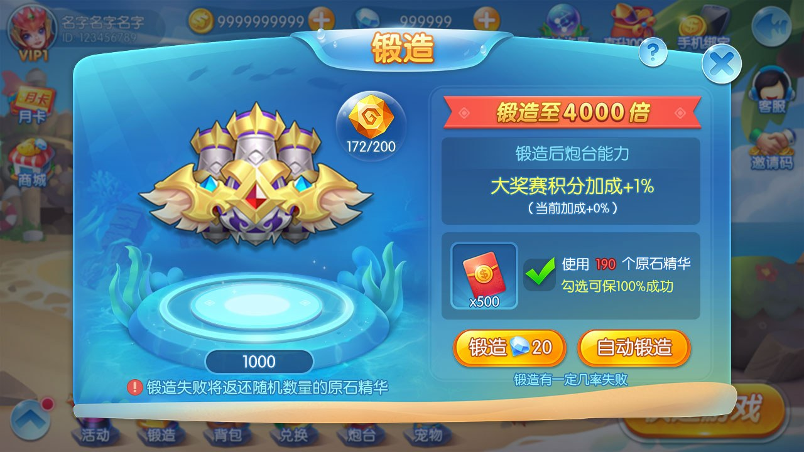
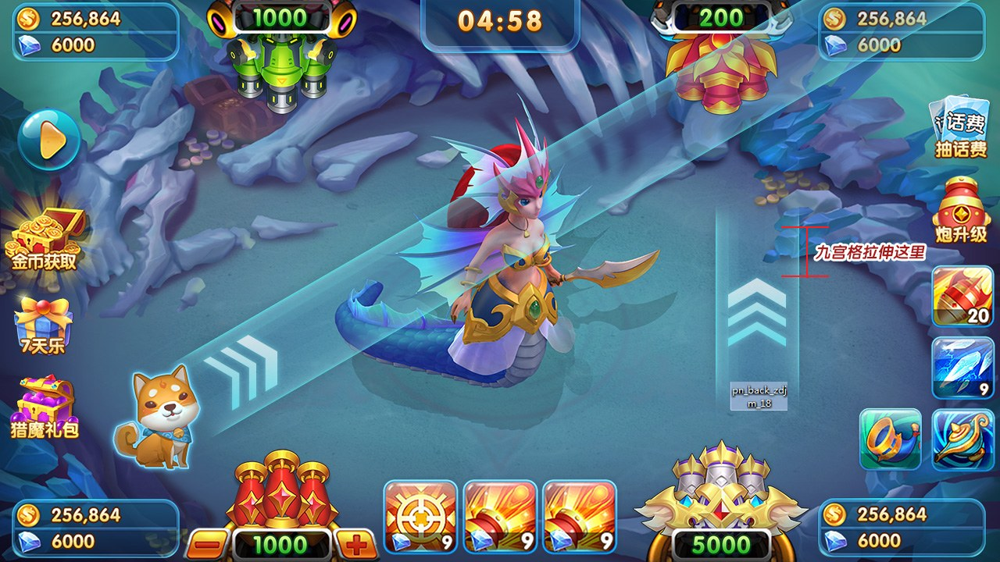

# 捕魚遊戲源碼｜街機捕魚、Cocos 用戶端與 C++ 伺服器資料

[簡體中文](README.zh-CN.md) · [繁體中文](README.zh-TW.md) · [English](README.en.md) · [產品頁面](https://niubideren111.github.io/Fishing-Game-Source-Code/zh-tw/)

面向街機捕魚玩法的用戶端與伺服器程式碼資料，展示房間選擇、炮台養成和 Boss 戰鬥效果。公開內容包含 JavaScript 炮台設定、遊戲監控檔案、C++ 控制邏輯和通訊協定文件。

**捕魚源碼 · 捕魚遊戲源碼 · 街機捕魚源碼 · 打魚遊戲源碼 · Cocos 捕魚源碼**

## 核心賣點

- **街機捕魚產品形態**：截圖涵蓋房間選擇、快速開始、炮台養成、鍛造和即時戰鬥場景。
- **炮台設定體系**：公開炮台基礎、等級、列表和皮膚設定，方便理解成長欄位之間的關係。
- **用戶端與伺服器資料**：JavaScript 用戶端檔案配合 C++ 控制邏輯，展示前後端協作線索。
- **通訊協定文件**：提供用戶端與伺服器、伺服器之間的二進位訊息及 MsgPack 資料說明。
- **戰鬥控制片段**：包含炸彈、寶石和其他控制邏輯檔案，可用於研究獎勵和戰鬥流程。
- **圖文多語言頁面**：提供簡體中文、繁體中文、English README 和 GitHub Pages 展示頁。

## 技術架構

| 層級 | 公開技術與檔案 |
|---|---|
| Cocos 用戶端資料 | JavaScript 設定、`main.js`、`GameMonitor.js` 及 Unity 風格 `.meta` 檔案 |
| 遊戲設定 | `BYCannonConfig.js`、等級、列表、皮膚和表情設定 |
| C++ 邏輯片段 | `bombctrl.cpp`、`rb_ctrl.cpp`、`wctrl35.cpp`、`wctrlbaoshi.cpp` |
| 通訊協定 | 固定封包標頭、二進位位元組流、MsgPack 內容及服務編號約定 |
| 建置資料 | `Makefile` 與公開程式碼檔案 |
| 產品資料 | 房間、養成、鍛造、炮台和戰鬥效果截圖 |

資料關係可概括為：用戶端設定和監控負責表現與狀態入口，通訊協定連接遊戲服務，C++ 檔案承接部分戰鬥及控制邏輯。完整建置仍需確認引擎版本、相依套件、資源、入口工程和伺服器環境。

## 遊戲內容

| 內容 | 公開資料呈現 |
|---|---|
| 房間選擇 | 多個房間入口及快速開始介面 |
| 炮台系統 | 炮台基礎屬性、等級、列表、皮膚和外觀設定 |
| 養成與鍛造 | 炮台成長及鍛造產品介面 |
| 捕魚戰鬥 | 魚群、炮台發射、命中特效及獎勵回饋畫面 |
| Boss 場景 | 產品截圖展示大型目標與戰鬥效果 |
| 炸彈與特殊獎勵 | C++ 炸彈使用、寶石和控制邏輯片段 |
| 社交表達 | `BYEmojiConfig.js` 表情設定資料 |
| 排行資料 | 公開排行榜表格及相關產品資料 |

## 玩家體驗

- **進入路徑清楚**：房間選擇和快速開始縮短進入遊戲的步驟。
- **成長目標可見**：炮台等級、皮膚、養成和鍛造形成持續升級目標。
- **戰鬥回饋直觀**：炮彈、命中、魚群和獎勵特效強化即時回饋。
- **階段變化豐富**：普通捕魚、特殊獎勵與 Boss 場景形成節奏變化。
- **設定便於調整**：炮台與等級設定可作為體驗平衡和版本迭代的閱讀入口。

玩家體驗描述來自公開截圖和設定結構，實際手感、效能與數值平衡需要在完整工程中透過真機和伺服器聯調驗證。

## 專案重點

### 炮台與養成設定

從 BYCannonConfig.js、等級和皮膚設定中檢視欄位及設定關係。

### 用戶端與伺服器協作

結合 GameMonitor.js 與通訊協定文件理解訊息流轉。

### 戰鬥效果與控制邏輯

房間、養成與 Boss 截圖配合 C++ 控制檔案，展示玩法與實作資料。

## 資料閱讀與核對方式

1. **先確認產品形態**：依序檢視截圖與圖說，確認產品類型和可見功能流程。
2. **再核對檔案證據**：直接開啟下方列出的原始碼或文件，不只依賴功能描述。
3. **檢查可建置範圍**：確認欲執行的部分是否具備相依套件、資源、設定與啟動腳本。
4. **確認授權**：閱讀儲存庫授權；商業素材及完整工程交付應另行取得書面授權。

## 產品截圖






## 公開原始碼與資料

| 檔案 | 說明 |
|---|---|
| [BYCannonConfig.js](BYCannonConfig.js) | 炮台基礎設定 |
| [BYCannonLevelConfig.js](BYCannonLevelConfig.js) | 炮台等級設定 |
| [GameMonitor.js](GameMonitor.js) | 用戶端遊戲監控 |
| [bombctrl.cpp](bombctrl.cpp) | C++ 控制邏輯片段 |
| [客户端与服务器通信协议.md](%E5%AE%A2%E6%88%B7%E7%AB%AF%E4%B8%8E%E6%9C%8D%E5%8A%A1%E5%99%A8%E9%80%9A%E4%BF%A1%E5%8D%8F%E8%AE%AE.md) | 用戶端與伺服器端協議 |
| [服务器间通信协议.md](%E6%9C%8D%E5%8A%A1%E5%99%A8%E9%97%B4%E9%80%9A%E4%BF%A1%E5%8D%8F%E8%AE%AE.md) | 服務間協議 |

## 開始閱讀

```bash
git clone https://github.com/niubideren111/Fishing-Game-Source-Code.git
cd Fishing-Game-Source-Code
```

## 常見問題

### 公開用戶端文件使用什麼語言？

目前公開設定和邏輯檔案主要為 JavaScript，伺服器片段為 C++；產品說明採用 Cocos 用戶端定位。

### 想了解炮台系統從哪裡開始？

先閱讀 BYCannonConfig.js，再對照等級、列表和皮膚設定；通訊流程檢視協定文件。

## 後續資料完善方向

補充 Cocos 具體版本、可公開的目錄結構、設定欄位解釋及協定請求回應範例；大型資源包放入 Releases。後續更新還應加入版本化相依清單、經過驗證的建置或匯入步驟、簡明架構／產品流程圖，以及能對應真實檔案變更的版本記錄。大型授權資源可放入 GitHub Releases 並提供校驗值，不能提交密鑰、生產位址或使用者資料。

## 相關專案

- [Fishing-Game-Art-Assets](https://github.com/niubideren111/Fishing-Game-Art-Assets)
- [Chess-and-Card-Game-Product-Design-Copy](https://github.com/niubideren111/Chess-and-Card-Game-Product-Design-Copy)

## 資料範圍與授權

公開儲存庫提供程式碼片段、設定表、協定文件和產品截圖；不將目前檔案集合描述為可直接啟動的完整遊戲工程。公開內容以實際檔案、相依套件與授權為準，不承諾搜尋排名、直接上線或固定效能結果。

- Telegram: [@fox_lovemyself](https://t.me/fox_lovemyself)
- GitHub: [Fishing-Game-Source-Code](https://github.com/niubideren111/Fishing-Game-Source-Code)
